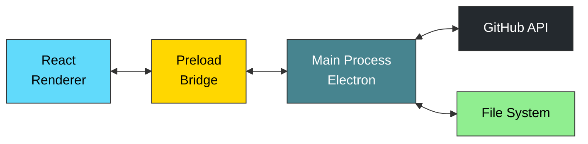
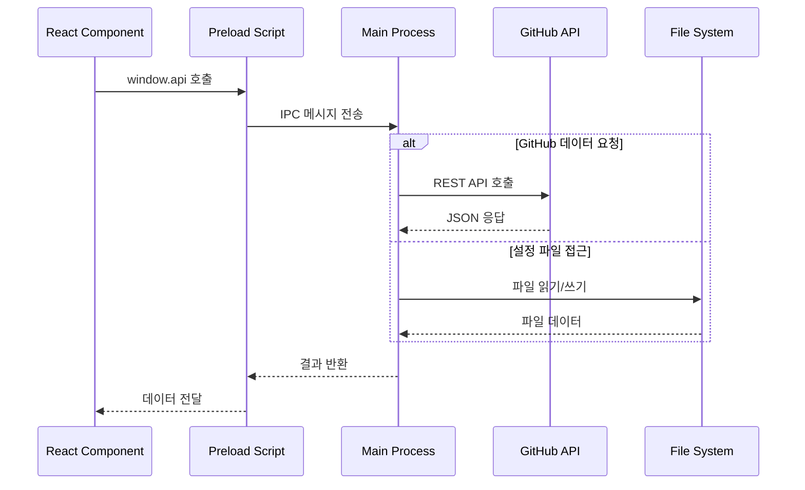

# GitHub PR Viewer

GitHub 조직의 Pull Request를 시각적으로 관리하고 분석하는 Electron 기반 데스크톱 애플리케이션입니다.

## ✨ 주요 기능

- **📊 PR 시각화**: 날짜별 히트맵과 차트를 통한 PR 활동 분석
- **🔍 다중 리포지토리 조회**: 조직 내 여러 리포지토리의 PR을 한번에 수집
- **👥 팀 멤버 관리**: GitHub 사용자 ID와 팀 멤버 매핑 및 그룹 분류
- **🎯 필터링**: 사용자별, 리포지토리별, 상태별 PR 필터링
- **⚙️ 설정 관리**: GitHub 토큰, 리포지토리 목록, 멤버 설정

## 🛠️ 기술 스택

- **Frontend**: React 18 + TypeScript + Tailwind CSS
- **Desktop**: Electron 31
- **상태 관리**: Zustand + TanStack React Query
- **UI 라이브러리**: Radix UI + Recharts + Cal-heatmap
- **빌드 도구**: Electron Vite
- **API**: GitHub REST API (Octokit)

## 📁 프로젝트 구조

```
github-pr-viewer/
├── src/
│   ├── main/                    # Electron 메인 프로세스
│   │   └── index.ts             # GitHub API 호출, IPC 핸들러
│   ├── preload/                 # 보안 통신 브리지
│   │   └── index.ts             # API 노출 (window.api)
│   └── renderer/                # React UI
│       └── src/
│           ├── pages/           # 페이지 컴포넌트
│           │   ├── home/        # 홈페이지
│           │   ├── pull-requests/ # PR 조회 및 시각화
│           │   ├── repositories/  # 리포지토리 관리
│           │   ├── members/     # 팀 멤버 관리
│           │   └── settings/    # 설정
│           ├── entities/        # 비즈니스 로직
│           ├── widgets/         # 복합 위젯
│           └── shared/          # 공유 리소스
├── build/                       # Electron 빌드 리소스
└── resources/                   # 앱 리소스
```

## 🚀 시작하기

### 필수 요구사항

- Node.js (v18 이상)
- GitHub 개인 액세스 토큰 (PAT)

### 설치

```bash
npm install
```

### 개발 모드 실행

```bash
npm run dev
```

### 빌드

```bash
# TypeScript 타입 체크 + 빌드
npm run build

# 플랫폼별 배포판 생성
npm run build:win    # Windows
npm run build:mac    # macOS
npm run build:linux  # Linux
```

### 기타 명령어

```bash
npm run typecheck    # TypeScript 타입 체크
npm run lint         # ESLint 검사 및 자동 수정
npm run format       # Prettier 코드 포매팅
```

## ⚙️ 설정

### GitHub 액세스 토큰 설정

1. [GitHub Settings > Developer settings > Personal access tokens](https://github.com/settings/tokens)에서 새 토큰 생성
2. 필요한 권한: `repo` (리포지토리 액세스)
3. 앱의 설정 페이지에서 토큰 입력

### 리포지토리 설정

- 모니터링할 GitHub 조직의 리포지토리 목록을 설정
- 현재 `payhereinc` 조직 기준으로 구성됨

### 팀 멤버 매핑

- GitHub 사용자 ID와 팀 멤버 이름 연결
- 그룹별 분류 지원

## 🎯 사용법

1. **설정**: GitHub 토큰과 리포지토리 목록 설정
2. **PR 조회**: Pull Requests 메뉴에서 전체 또는 리포지토리별 PR 확인
3. **시각화**: 히트맵과 차트로 PR 활동 패턴 분석
4. **필터링**: 특정 사용자나 기간의 PR만 선별 조회

## 🏗️ 아키텍처

### IPC 통신 구조


### 데이터 흐름


## 🔧 개발 환경 설정

### 권장 IDE

- [VSCode](https://code.visualstudio.com/) + [ESLint](https://marketplace.visualstudio.com/items?itemName=dbaeumer.vscode-eslint) + [Prettier](https://marketplace.visualstudio.com/items?itemName=esbenp.prettier-vscode)

### TypeScript 설정

- 웹(`tsconfig.web.json`)과 노드(`tsconfig.node.json`) 별도 설정
- Path alias: `@/` = `src/renderer/src/`
- 엄격 모드 활성화

## 📊 데이터 범위

- **기간**: 2025-07-01 ~ 2025-10-01 (약 3개월)
- **조직**: `payhereinc`
- **페이지네이션**: 100개씩 자동 수집

## 🤝 기여하기

1. 이 저장소를 Fork
2. Feature 브랜치 생성 (`git checkout -b feature/amazing-feature`)
3. 변경사항 커밋 (`git commit -m 'Add amazing feature'`)
4. 브랜치에 Push (`git push origin feature/amazing-feature`)
5. Pull Request 생성

## 📝 라이선스

이 프로젝트는 MIT 라이선스 하에 배포됩니다.

## 🔗 관련 링크

- [GitHub REST API](https://docs.github.com/en/rest)
- [Electron 문서](https://www.electronjs.org/docs)
- [React 문서](https://react.dev)
